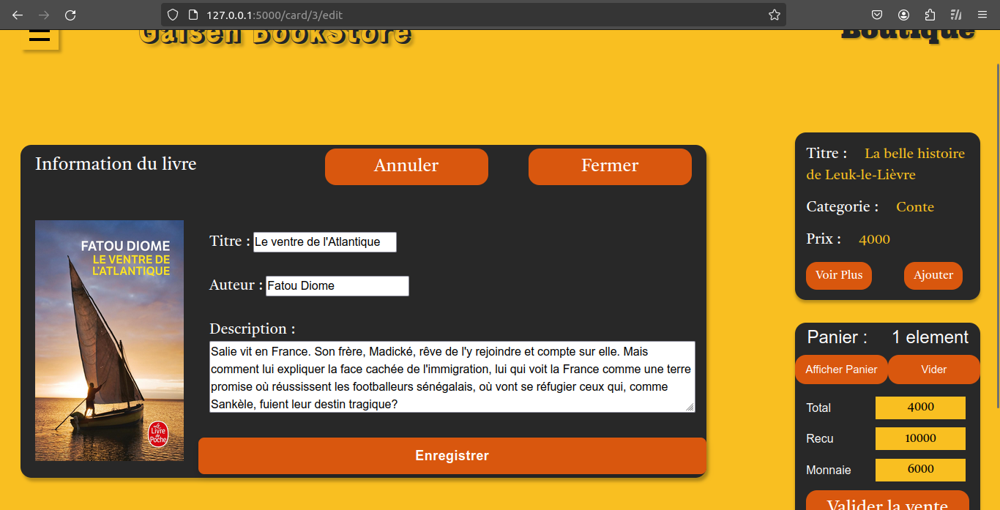

<h3>Sign up page</h3>


<h3>Login page</h3>


<h3>Edit Page when user is authenticated</h3>


<h3>Really Edit Book Page</h3>


<h3>Really Card Editable</h3>



<h3>V1 Edit Book Page</h3>


<h3>Navbar</h3>


<h3>table view</h3>


<h3>Card View</h3>


<h3>Detail View</h3>


Comment lancer ce projet :
- Installer python dans votre machine
- Cloner le projet afin de le telecharger
- Creer un environnement virtuelle
    ```py 
        Python -m venv .env
    ```
- Activer votre environnement virtuelle si vous etes sur linux:
    ```py 
        source .env/bin/activate
    ```
- Installer le requirement.txt qui est dans la racine du projet:
     ```py 
        pip install -r requirement.txt
    ```
- Lancer le fichier run.py afin de creer la db et de charger les données
    ```py 
        python run.py
    ```
- Et enfin lancer le fichier main.py pour visualiser le projet 
    ```py 
        python main.py
    ```
